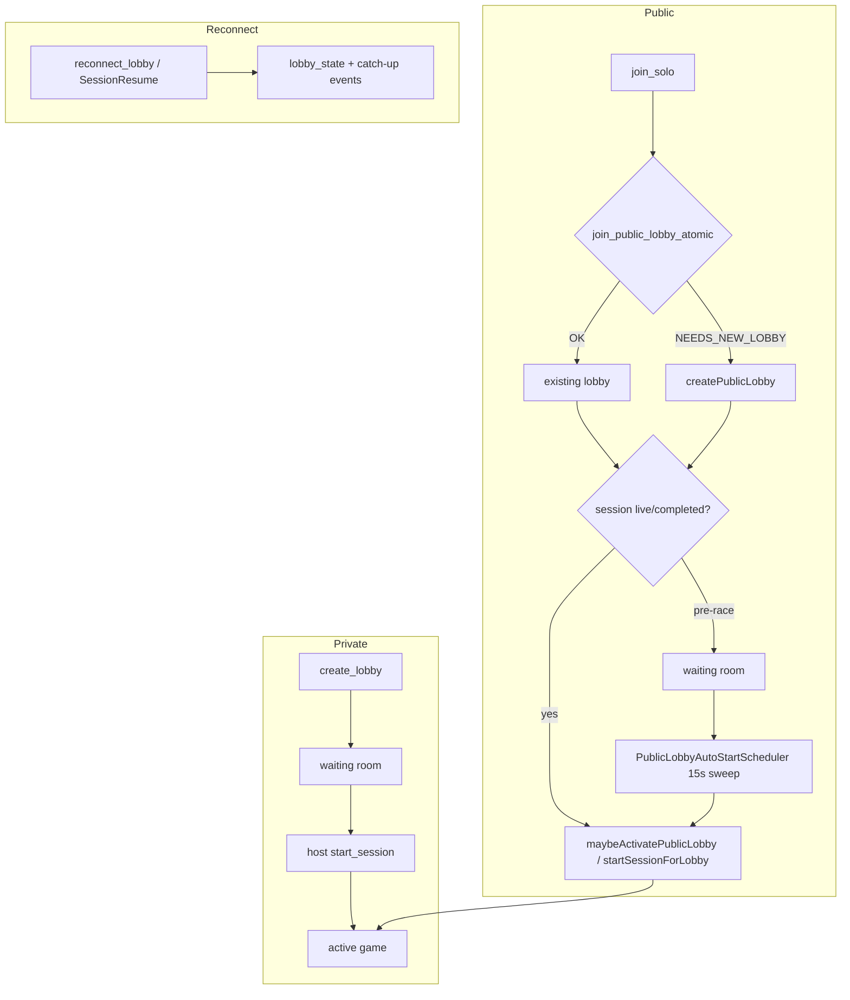

# Production Readiness Audit — Public & Private Lobby System

**Date:** 2026-06-12  
**Verdict:** **Ship** (after applying fixes in this branch)

---

## Executive Summary

The public/private lobby architecture matches the documented design: private lobbies are host-started; public lobbies use atomic Supabase matchmaking (`join_public_lobby_atomic`), auto-start sweeps, late-join lap tracking, and score restore via `leaderboard_archives`. Server authority is preserved throughout.

This audit found **3 P1 bugs** (all fixed) and several P2/residual items. Backend tests pass (214 tests). New coverage was added for `join_solo` matchmaking paths, public lobby retention, and sanitized-username client resolution.

**Before a live race weekend:** confirm `migration_public_lobbies.sql` is applied in production Supabase and run the manual QA checklist below.

---

## Flow Map

---

## Findings

| ID | Severity | Area | Description | File(s) | Fix Status |
|----|----------|------|-------------|---------|------------|
| L-01 | **P1** | Security / lifecycle | `start_session` allowed any DB host to manually start a public lobby after internal host left and `host_id` was reassigned | `server.ts` | **Fixed** — reject when `isPublic` |
| L-02 | **P1** | UX / correctness | `join_solo` aborted the join on auto-start failure, orphaning the DB user and stranding the client without `userId` | `server.ts` | **Fixed** — revert to waiting, complete join flow |
| L-03 | **P1** | UX | Lobby rejoin page matched players by typed username only; sanitized public names broke session persistence | `lobby/[code]/page.tsx` | **Fixed** — `join_result` + `resolveJoinedPlayer` |
| L-04 | **P1** | Correctness | `normalizeLateJoinLap(1.2)` returned `1` instead of `null`, showing a false late-join badge | `publicLobbyManager.ts` | **Fixed** |
| L-05 | P2 | Concurrency | Two concurrent `NEEDS_NEW_LOBBY` calls can create two empty public lobbies for the same session | RPC + `join_solo` | **Accepted** — both fill; atomic join prevents slot overfill |
| L-06 | P2 | Resilience | `startSessionForLobby` can leave lobby `active` in DB if runtime attach fails mid-flight | `server.ts` | **Partial** — join_solo reverts on catch; no global transaction |
| L-07 | P2 | Observability | `create_lobby` does not emit `join_result` (private flow relies on username match) | `server.ts` | Open — low risk for private lobbies |
| L-08 | P2 | Deployment | Production Supabase migration status not verifiable from code | `migration_public_lobbies.sql` | **Manual** — run SQL in dashboard before race |
| L-09 | P2 | Tests | `presenceManager` default-timeout test drifted after active timeout raised to 3h | `presenceManager.test.ts` | **Fixed** |
| L-10 | P2 | Host model | Public lobbies reassign `host_id` on player leave (internal only) | `lobbyManager.ts` | **Fixed** — skip reassignment when `isPublic` |

### Verified OK (no change required)

- Atomic RPC uses `FOR UPDATE SKIP LOCKED` and capacity guard — `migration_public_lobbies.sql`
- `join_lobby` on public lobbies runs `sanitizeUsernameForPublic` — bypass blocked
- `join_result` emitted before `lobby_state` on `join_lobby` and `join_solo`
- Active public lobbies retained when last player leaves; waiting public lobbies deleted when empty
- Finished lobbies reject joins (`joinLobby` + RPC status filter)
- Score restore bound to `lobby_id` + `archived_user_id`
- Metrics counters present: `lobby.solo_*`, `lobby.public_auto_started_total`, `lobby.created_total`, `lobby.joined_total`
- Frontend: public waiting UI hides host start bar; solo session priority live → pre-race → replay

---

## Residual Risks / Known Limitations

1. **Render cold start** — Multiple simultaneous reconnects may briefly fail; frontend shows warming banner and retries.
2. **No Redis adapter by default** — Single Render instance; horizontal scaling requires `FF_REDIS_ADAPTER=true`.
3. **Runtime attach partial failure** — Rare edge case if SignalR/OpenF1 fails after DB status flip; auto-start sweep or re-join can recover.
4. **Frontend Jest** — Pre-existing `tsconfig` `rootDir` issue blocks local frontend test runs; new `resolveJoinedPlayer.test.ts` is valid but shares that infra gap.
5. **Duplicate empty public lobbies** — Acceptable; matchmaking fills most-full lobby first.

---

## Manual QA Checklist (pre–live race weekend)

### Private lobby
- [ ] Home → Play with Friends → Create private lobby → land in waiting room with host badge and start bar
- [ ] Share code → second browser joins → both appear in grid
- [ ] Host selects live/replay session → Start → both redirect to `/game/[code]`
- [ ] Non-host cannot start (server error if forced via socket)

### Public matchmaking
- [ ] Two browsers → Play Solo → same live session → same lobby code
- [ ] Fill lobby to `MAX_PLAYERS_PER_LOBBY` → 31st player gets a **new** lobby code
- [ ] Pre-race join → waiting room shows “Race has not started yet” (no host controls)
- [ ] When session goes live (or sweep runs) → auto-redirect to game

### Mid-race & restore
- [ ] Join solo mid-race → “Joined lap X” badge correct (X > 1)
- [ ] Leave tab idle past inactivity timeout → rejoin with restore token → score preserved
- [ ] Refresh during active race → `SessionResume` reconnect restores snapshot + active question

### Edge cases
- [ ] Join finished lobby by code → “already finished” error
- [ ] Profane solo username → sanitized name shown; session saved via `join_result`
- [ ] Last player leaves active public lobby → lobby persists; new solo player can join same session pool
- [ ] Last player leaves waiting **private** lobby → lobby deleted

### Production infra
- [ ] Supabase: `is_public`, `public_session_key`, `joined_at_lap` columns exist
- [ ] Supabase: `join_public_lobby_atomic` RPC exists
- [ ] `GET /health/scaling` returns expected limits and metrics snapshot

---

## Tests Added / Updated

| File | Coverage |
|------|----------|
| `backend/src/lobby/publicLobbyManager.test.ts` | `normalizeLateJoinLap`, `joinExistingPublicLobby`, `shouldAutoActivatePublicLobby` |
| `backend/src/lobby/lobbyManager.public.test.ts` | `removePlayer` public active retention vs waiting deletion |
| `backend/src/lobby/presenceManager.test.ts` | 3h active-race inactivity threshold |
| `frontend/src/lib/resolveJoinedPlayer.test.ts` | Sanitized username resolution via `userId` |

Run backend tests: `cd backend && npm run test`
